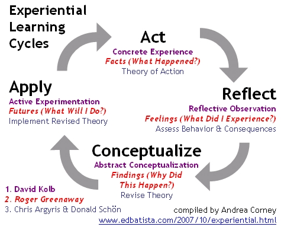

# Final Self Assessment

* Please name your file as lastname\_\_senior\_sp20\_finalassessment.pdf
* Export as a pdf and upload to your project documentation folder for your [end of semester deliverables](./).

## Reflection

Any action without reflection is meaningless; real learning only occurs as part of a reflective process. Reflection is studying your own practice as seriously as you study anything; it involves thinking about why, what, and how you create something. In any learning situation you should study beforehand, make/do, debug, reflect, adjust, and do it all over again. Learning happens in a cycle, illustrated in the diagrams below.

As a student, you should also develop your critical thinking skills. This will initially involve critiquing other people’s work but ultimately you also want to be able to critique your own work. This will allow you to develop as a creator.

**Of Project**

* Critically analyze/evaluate your senior project process and final **execution**.
* What qualitative description would you give your overall **process** and why? \(i.e. excellent, very good, good, etc. Consult the grading overview descriptions presented earlier in this syllabus.\)
* What qualitative description would you give the final execution of your project so far and why?
* Do your deliverables match your initial concept \(or last impact statement\)?
* Did you do what you said you were going to do \(integrity, accountability\)?
* Did you execute all aspects of your project by the best means possible \(craft and care\)?
* Lessons Learned / What would you do differently if you could redo this project?

**Of Self**

* How have you grown as a creative over the course of the semester?
* If your growth is not where you would like it to be, what specific steps will you take to improve in the future?
* What other things have you learned about yourself in this course?

**Of Classmates**

* Which classmate\(s\) inspired you the most and why? 

**Of The Course**

* Feedback on the senior project syllabus 
* Feedback on senior project communication \(gitbook and slack\)
* Feedback on the senior project course content \(project, assignments, readings, etc.\)
* Feedback on the senior project course structure \(presentations, group critiques, demos, one on one meetings, accountability partners, etc\)
* Feedback on **senior project** remote instruction \(including  feedback videos and check-in/check-out exercise\).
* What change\(s\) would you make to senior project and why?
* What change\(s\) would you make to remote instruction for senior project and why?
* What resources have you found to be specifically helpful to you for this course? And why?

