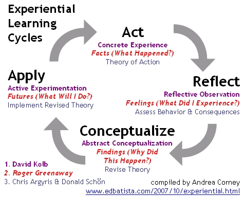
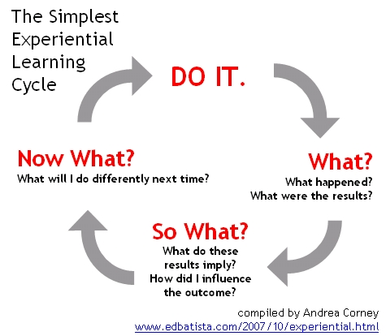

# Midterm Self-Assessment

* Please name your file as lastname\_senior\_sp20\_midtermassessment.pdf
* Direct Message as pdf to deangela on Slack.
* Export as a pdf and upload to your project documentation folder for your [end of semester deliverables](./).

## Reflection

Any action without reflection is meaningless; real learning only occurs as part of a reflective process. Reflection is studying your own practice as seriously as you study anything; it involves thinking about why, what, and how you create something. In any learning situation you should study beforehand, make/do, debug, reflect, adjust, and do it all over again. Learning happens in a cycle, illustrated in the diagrams below.

As a student, you should also develop your critical thinking skills. This will initially involve critiquing other people’s work but ultimately you also want to be able to critique your own work. This will allow you to develop as a creator.

**Of Project**

* Critically analyze/evaluate your senior project **process**.
* At this point in time, what qualitative description would you give your overall process and why? \(i.e. excellent, very good, good, etc. Consult the grading overview descriptions presented earlier in the [syllabus](../syllabus.md).\)
* Reflect upon your project's progress at this point in time.
* What feedback about your project \(from anyone\) has been the most useful to you and why?
* What are your open issues?
* What are your risks of failure \(lack of tech, time, knowledge, money, etc.\)?
* Create a contingency plan for major risks.

