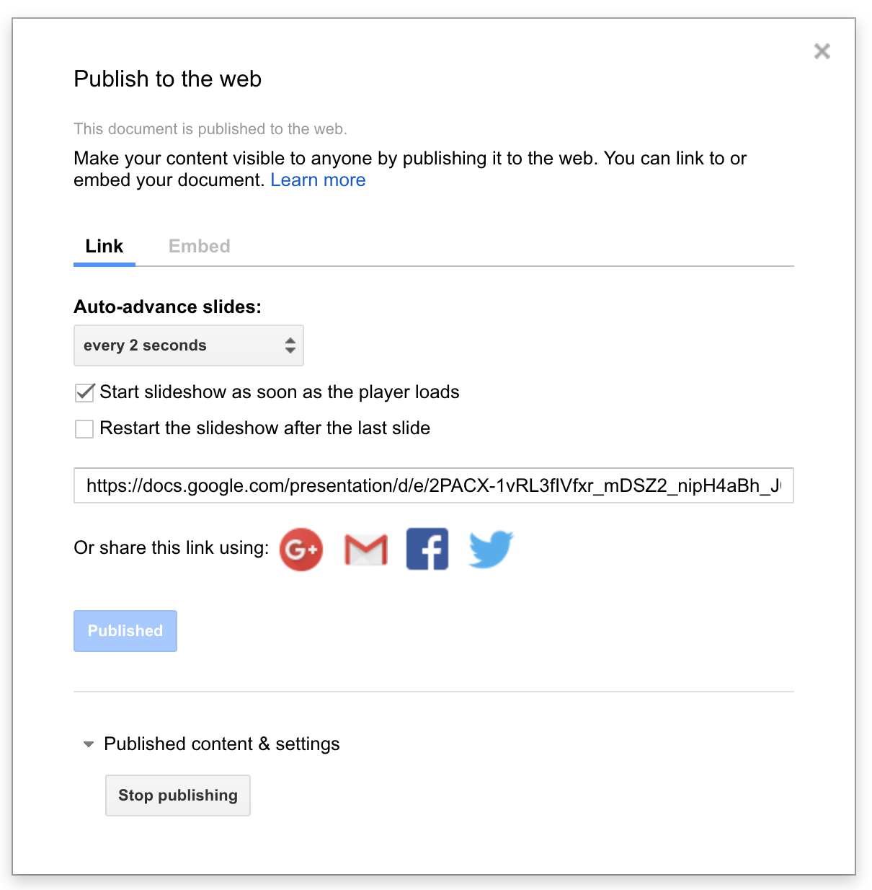

# Pecha Kucha presentation

> **WHAT IS PECHA KUCHA?** \(source:[ https://www.pechakucha.com/about](https://www.pechakucha.com/about)\) PechaKucha \(Japanese for “chit chat”\) is the world’s fastest-growing storytelling platform, used by millions around the globe. 20 slides. 20 seconds of commentary per slide. That’s it. Simple. Engaging. Spurring authentic connections. Global innovators use the PechaKucha platform to create powerful, visually-compelling stories that move audiences in less than 7 minutes.

On the first day of class, you will present a **pecha kucha \(20 slides x 20 seconds each, for a total of 6 minutes and 40 seconds\)**. The goal of your pecha kucha presentation is to share who you are, what inspires you, what kinds of work you have made over your course of study in IDM, inside and outside of the classroom, and what your brainstorming and ideas are for your senior project.

The timing of a pecha kucha is super fast. I HIGHLY suggest that you **practice MULTIPLE TIMES in advance**.

This is your opportunity to start the semester off with momentum and make a really awesome senior project. The clock is ticking, and time waits for no one!

## Here are instructions to setup your presentation:

1. Create a slideshow with **20** slides using **google slides.**
2. When it’s done, go to **File &gt; Publish to the web.**
3. Copy the provided link and test it in your browser. 
4. **In the URL**, change the value of the delayms variable to 20000 \(i.e. delayms=**20000**\). This will make the slides advance every 20s.
5. Add this updated URL and your name to this [google doc](https://docs.google.com/document/d/1RhjN0MG0Fkuu44ZMliKjLGWCdgJoYqq2s5ZlKdjogKQ/edit?usp=sharing) before the beginning of the first day of class.

## The content of your presentation should include the following:

_You can decide how to allocate your 20 slides to address the following. Please use this order and headings_:

* **I AM**: Who are YOU? Show and discuss something interesting or informative about you that relates to your project ideas.
* **INSPIRATION**: Who or what inspires you? List other artists, designers, creative technologists, and/or entrepreneur’s & their work that influences your work. Do you remember the course, ideation & prototyping? What are your **inputs**?
* **YOUR PAST WORK**: Show examples of at least 3 to 7 examples of your past work inside and/or outside of the classroom. What kinds of work you have made over your course of study in IDM that are related to your project idea?
* **MOTIVATION**: Who or what is the motivation behind your senior project focus? Why are you doing this project? What are you exploring or discovering here? What questions are you asking? Do you love your ideas? Does it feel right on instinct? Are you willing to commit to this project? Are you willing to live, sleep, and eat with this project?
* **THEME\(s\)/CONCEPT\(s\)**: What are your project's theme\(s\) or conceptual underpinnings? \(Think 1 to 3 hashtags.\)
* **ELEVATOR PITCH**: What is your project's "elevator pitch"? Think phrase or 1 sentence maximum WITHOUT referring to a medium of delivery \(i.e. XR, UX, app, installation, etc\). What is your project about?
* **THREE ACT STRUCTURE**: What is your project's 3-act structure? Reference the reading from _Do The Work_ by Steven Pressfield. If you have watched the watchmen tv series, it's 3-act structure could be: Who is hiding behind the masks and why?, understanding Angela's and her grandfather's nostalgia/trauma, and transferring Dr. Manhattan's power.
* **TARGET AUDIENCE**: Who is this project for? Please note that everyone is not a valid answer. Target is the key word here. Who cares? Who _will_ care? Who is your target audience? What do you want your target audience to experience when they interact with your project?
* **\(OPTIONAL\) BRAINSTORMING DOCUMENTATION**: 
  * [Card Sorting](../brainstorming/card_sorting.md)
  * [Project Mind Map](http://lifehacker.com/how-to-use-mind-maps-to-unleash-your-brains-creativity-1348869811) 
  * [SCAMPER Technique](http://www.mindtools.com/pages/article/newCT_02.htm)
  * [Storytelling Exercise](../brainstorming/storytelling_exercise.md)
  * [Recommended Resources](../recommended_resources.md)
* **RESEARCH DIET**: List or show 3 different books, articles, podcasts, videos \(i.e. [TED](http://www.ted.com)\), or exhibition or event \(that took you out of your home\) that you have read, watched, listened, or experienced that has informed your project ideas. 
  * Also, post your response and the URLs of the items in your research diet on your [process website](website.md). How is it relevant to your project and which ideas would you like to further investigate? Discuss how the all connect or diverge. If you attended an exhibition or event, please post photos if at all possible.
* **PROJECT IDEAS**: 3 different slides should illustrate 3 different possible ideas for your senior project, based on your focus topic, theme, or issue. Also, address What form \(medium\) it _might_ take, how this form might specifically address your topic, theme, or issue, and what the form might communicate. Your idea must be related to your theme focus and your previous work. Remember, you only have 20 seconds to talk about each idea so your slide will need to be concise for each idea.
* **RELATED PROJECTS**: Compare and contast similar projects in topic, theme, or issue \(not limited by medium\) by other artists, designers, creative technologists, or entrepreneurs to yours. Keep in mind the [SCAMPER Technique](http://www.mindtools.com/pages/article/newCT_02.htm).

