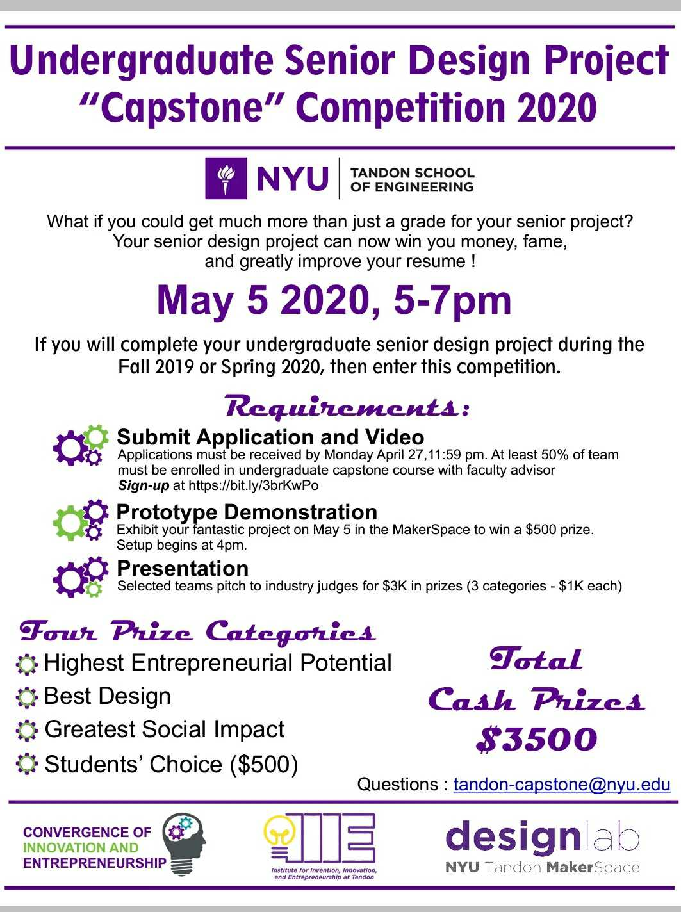
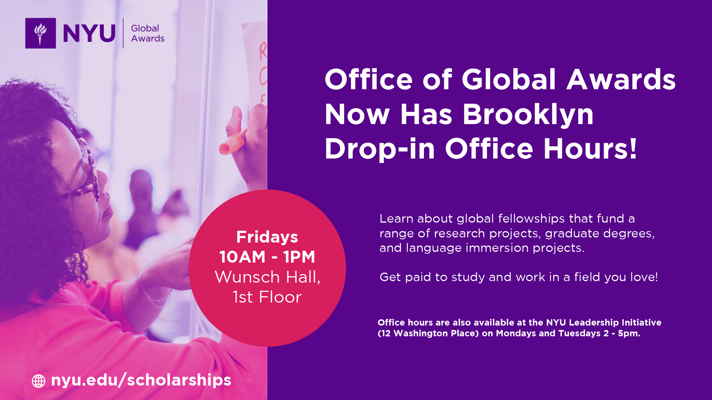

# Week 4 Detail Feb 24

## Deliverables \(DUE ON DATE LISTED\)

* \(OPTIONAL\) If you are going to attend the [**IMA/Games/IDM Career Fair!**](https://tisch.nyu.edu/itp/events/spring-2020/ima-games-idm-career-fair) for EXTRA CREDIT, please direct message me on slack letting me know that you will do so.
  * Document the experience on your [process website](../pre-work/website.md).
* Meet with your [accountability partner](../assignments/accountability_partner.md) at least once, if not twice, over the next two weeks. We don't have class next week \(2/17\) due to President's day. 
  * Document your [accountability partner](../assignments/accountability_partner.md) meeting\(s\) on your [process website](../pre-work/website.md).
* Draft list of [resources and milestones](../project_plan/) for your project.
* Continue to [research and design](../project_plan/) your project.
* Document your process and project, which includes your  [resources and milestones](../project_plan/) and [research and design](../project_plan/), on your [process website](../pre-work/website.md).

## Class

* Guest: Kristofer G. Larsen, kristofor.larsen@nyu.edu, Assistant Director, Office of Global Awards
* Class Discussion: [IMA/Games/IDM Career Fai**r!**](https://tisch.nyu.edu/itp/events/spring-2020/ima-games-idm-career-fair)
* Review [Personal Kanban](../assignments/personal_kanban.md), a visual representation of your milestones
* Group critique: 
  * [research and design](../project_plan/)
  * [resources and milestones](../project_plan/)
* Check-in with your accountability partner.

